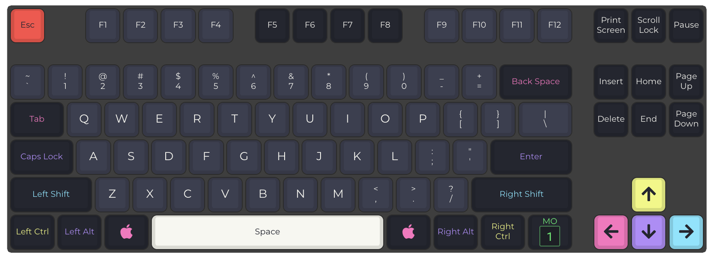

# Massdrop CTRL Keymap

In this repo you can find my customized QMK firmware for the Massdrop CRTL keyboard.

[](./keymap.c)

The Massdrop CTRL is a TKL mechanical keyboard featuring dual USB-C connectors,
an integrated Hi-Speed USB 2.0 hub,
and fully customizable RGB backlighting and underlighting.

* Keyboard Maintainer: [Massdrop](https://github.com/massdrop)  
* Hardware Supported: Massdrop, Inc. CTRL PCBs utilizing Microchip&#39;s ATSAMD51J18A MCU and USB2422 2-Port USB 2.0 Hi-Speed Hub Controller, and ISSI&#39;s IS31FL3733 LED Drivers.  
* Hardware Availability: [Massdrop CTRL Mechanical Keyboard](https://www.massdrop.com/buy/massdrop-ctrl-mechanical-keyboard)

This custom keymap is based on the [stock Mac keymap](https://github.com/qmk/qmk_firmware/tree/master/keyboards/massdrop/ctrl/keymaps/mac).

## Download

[](https://github.com/Cyclenerd/qmk-massdrop-ctrl/actions/workflows/compile.yml)

The firmware is compiled automatically via [GitHub Actions](https://github.com/Cyclenerd/qmk-massdrop-ctrl/actions/workflows/compile.yml) and stored as artifact for three days.

## Compile

[](https://gitpod.io/#https://github.com/Cyclenerd/qmk-massdrop-ctrl)


With QMK CLI:
```shell
# Setting Up Your QMK Environment
sudo apt install -y git python3-pip
# Install the QMK CLI
python3 -m pip install --user qmk
# Setup
qmk setup
# Compile firmware with default keymap
qmk compile -kb massdrop/ctrl -km default
```

Without QMK CLI:
```shell
git clone --recurse-submodules https://github.com/qmk/qmk_firmware.git
cd qmk_firmware
util/qmk_install.sh
make massdrop/ctrl:default
```

[Need more help?](https://github.com/qmk/qmk_firmware/blob/master/docs/newbs_getting_started.md)

## Add Custom Keymap

```shell
# Clone this repo
git clone https://github.com/Cyclenerd/qmk-massdrop-ctrl.git
# Link custom keymap to QMK firmware
ln -s /mnt/c/Users/Nils/Projects/qmk-massdrop-ctrl/ qmk_firmware/keyboards/massdrop/ctrl/keymaps/nils
# Compile custom keymap
qmk compile -kb massdrop/ctrl -km nils
```

## Flash

Bootmode (`MD_BOOT`): <kbd>FN</kbd> + <kbd>B</kbd>

Flash `massdrop_ctrl_nils.bin` (in root folder `qmk_firmware`) with [QMK Toolbox](https://github.com/qmk/qmk_toolbox).


## More

* [QMK Configurator](https://config.qmk.fm/#/massdrop/ctrl/LAYOUT)
* [Keycodes Overview](https://docs.qmk.fm/#/keycodes)

## Contributing

Have a patch that will benefit this project?
Awesome! Follow these steps to have it accepted.

1. Please read [how to contribute](CONTRIBUTING.md).
1. Fork this Git repository and make your changes.
1. Create a Pull Request.
1. Incorporate review feedback to your changes.
1. Accepted!


## License

All files in this repository are under the [GNU General Public License v2.0](LICENSE) unless noted otherwise.